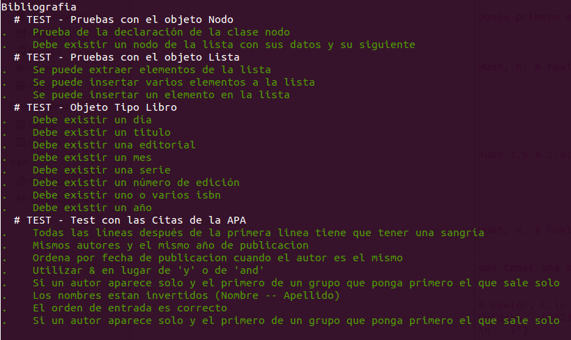

# PRACTICA 9 : Programación orientada a objetos - Módulos

En esta práctica realizaremos una modificación en nuestra práctica anterior, añadiendo los modulos comparable y enumerable. 
Además de la integración en travis.

## Herramientas de Test

En la práctica se implementa usando metodología de desarrollo dirigido por pruebas TDD, la herramienta usada es RSPec version 3.3.0

Para instalar la herramienta rspec se han usado los comandos: 

    $ bundle install rspec
    $ bundle exec rspec --init
   
Para ejecutar los tests se hace un rake, ya que en el Rakefile hay una tarea que llama a la herramienta rspec.
    $ rake

	

## Guard

Para ejecutar guard en la práctica sirve simplemente con el comando: 
    $ guard 

Se ha seguido el directorio completo de la práctica.

## Travis

Para la práctica también se ha usado la herramienta Travis.

## Coveralls

## Autor y Asignatura

Autor: Juan Ignacio Hita Manso
Asignatura: Lenguajes y paradigmas de la programación

